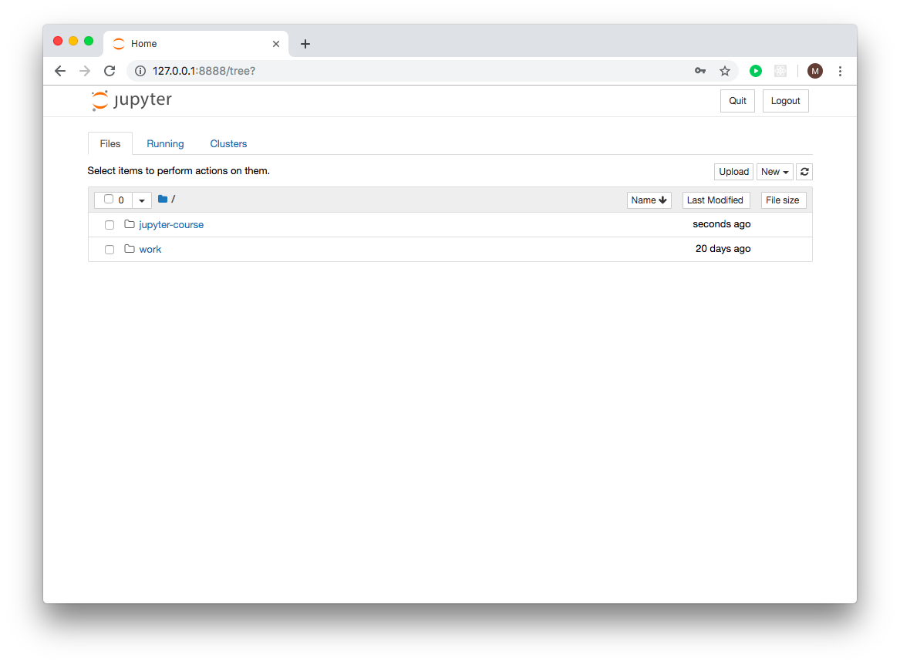
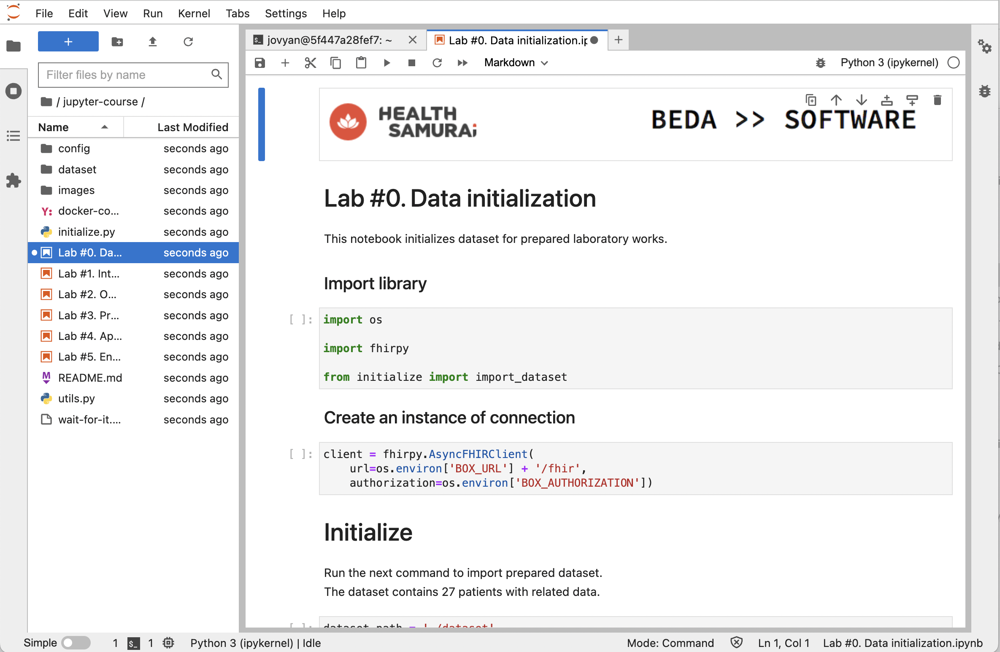
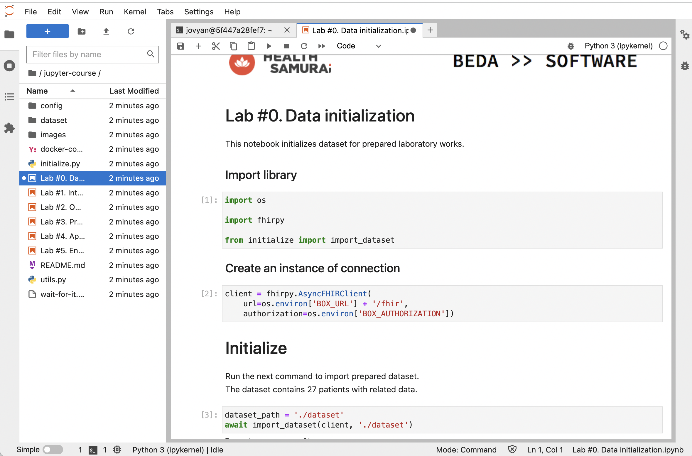

<table width="100%" border="0">
<tr>
<td width="50%">
<a href="https://www.health-samurai.io/">

</a>
</td>
<td width="50%">
<a href="http://beda.software/">

</a>
</td>
</tr>
</table>

# Learn basics of FHIR with Jupyter 
# Interactive laboratory works

Health Level 7 (HL7) Fast Healthcare Interoperability Resources (FHIR) is an industry standard for exchanging healthcare data. HL7 monitors implementations of FHIR and continually works to improve the specifications, in addition to providing support to those implementing FHIR at their organization. FHIR stands for Fast Healthcare Interoperability Resources and uses RESTful web services to share resources, describes how data are represented or organized. RESTful services (the acronym stands for Representational State Transfer) is an architectural style that specifies constraints and used in FHIR to exchange data using the structure it defines. In FHIR, there are more than 100 resources covering data such as problems and medication that are reused across FHIR “profiles.” Profiles provide general agreement on how different data should be shared and represented.
The course is built with AidBox platform - FHIR cloud backend.

Once you have completed this course, you will be able to walk your way through basic FHIR resources and you will know how to perform basic operations.
If you would like to follow the course and try out the examples, you should have basic experience programming in Python.

The course consists of 5 interactive laboratory works. All laboratory works are in the Aidbox cloud platform. So, you need just your browser and internet connection.

## Creating a box
To get an access to the interactive environment for the laboratory works, at first, you need to sign up and create your own AidBox account.

You can do this here https://aidbox.app
There are two options for sign up and login:
* using github
* using google


For example, if you've chosen github:


Fill in the required fields and grant an access for the Aidbox application.
After that, you'll be redirected to the main page, where you can see your boxes.


Just after sign up, there are no boxes in the list. Let's create new one. Click the 'New Box' button.


Enter the box name field. Write here whatever you want.
By default, the FHIR 3.0.1 option is selected, leave it as is, because we use this version in our laboratory works.
Select the 'Free Tier' to use Aidbox.Cloud in the trial mode.


After the all fields are filled, click 'Create' button.
You'll see your just created box on the main page.


You've just created your own separated aidbox instance that includes DB and REST API!
Click the box. You will see the box settings page.

## Creating a jupyter instance

Go to the Jupyter section.


Click 'Open jupyter' link to set up jupyter environment.


For the moment, you don't have a jupyter instance created. Let's create it by clicking 'Create new' button.


After you created a jupyter instance, you should wait about a minute (sometimes it could take longer).
Refresh the page manually, until the status become 'Ready'


Your own separated jupyter instance is created!
Click 'Open in new window' link.


It is a main screen of jupyter web interface.
Now you need to clone the current repository using the terminal.  Click the 'New' button as it shown on the screen below, and select 'Terminal'.


The new terminal window will be opened.


This terminal provides the full access to the file system. Input the next command into the terminal to clone the repository:
```
git clone https://github.com/Aidbox/jupyter-course
```


Go back to the jupyter web interface. Now you can see a just cloned directory 'jupyter-course'.



Click the 'jupyter-course' directory to open it.



The directory contains this instruction and laboratory works. Before you start doing them, we need to initialize the DB with the demo data.

## Database initialization

Click 'Lab #0. Data initialization.ipynb' to open an initial notebook.


Run this notebook step-by-step using 'Run' command from toolbar.
As a result, you should get the same messages as on the screen below.


If you see an error message or zero patients imported, contact the support team support@health-samurai.io for help.
Also, don't try to run this notebook again, you will always get an error.

In other cases, you are ready to start doing laboratory works.
Start from the first 'Lab #1. Introduction to FHIR resources.ipynb'
Good luck!



# Support

If you have any questions about the laboratory works, please create an issue in the repository. Or just contact us at hi@beda.software.

# What's next?

If you like the laboratory works and would like to keep learning, we are happy to prepare more new laboratory works.
Please, visit our github and star our tools:

https://github.com/beda-software/tk3  
https://github.com/beda-software/fhir-py 

Once both repositories get 100 stars, we'll share the next two laboratory works about Machine Learning and Data Analysis for FHIR.

# Authors

(c) 2018 <a href="http://beda.software/">Beda.Software</a>, <a href="https://www.health-samurai.io/"> Health Samurai</a>
