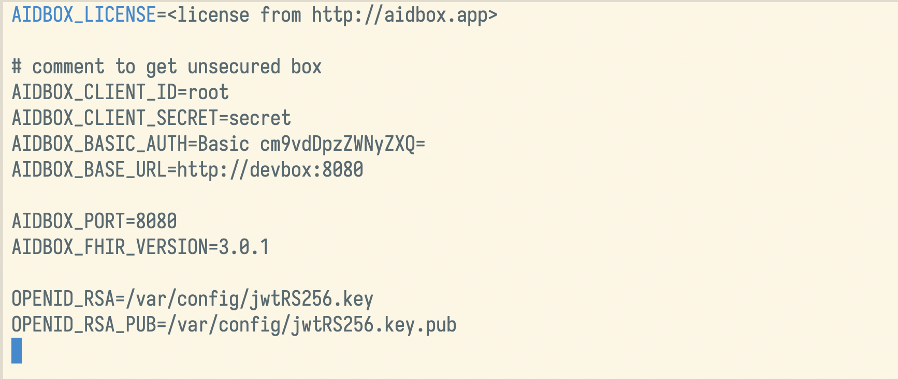
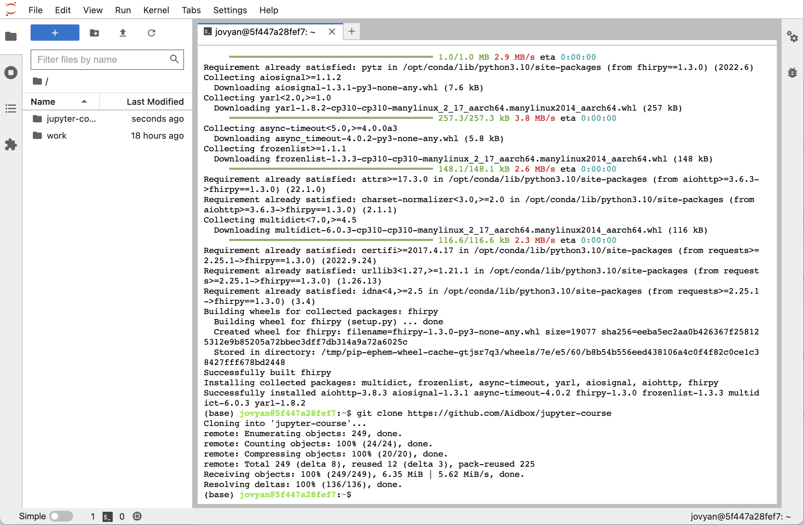

<table width="100%" border="0">
<tr>
<td width="50%">
<a href="https://www.health-samurai.io/">

</a>
</td>
<td width="50%">
<a href="http://beda.software/">

</a>
</td>
</tr>
</table>

# Learn basics of FHIR with Jupyter
# Interactive laboratory works

Health Level 7 (HL7) Fast Healthcare Interoperability Resources (FHIR) is an industry standard for exchanging healthcare data. HL7 monitors implementations of FHIR and continually works to improve the specifications, in addition to providing support to those implementing FHIR at their organization. FHIR stands for Fast Healthcare Interoperability Resources and uses RESTful web services to share resources, describes how data are represented or organized. RESTful services (the acronym stands for Representational State Transfer) is an architectural style that specifies constraints and used in FHIR to exchange data using the structure it defines. In FHIR, there are more than 100 resources covering data such as problems and medication that are reused across FHIR “profiles.” Profiles provide general agreement on how different data should be shared and represented.
The course is built with AidBox platform - FHIR cloud backend.

Once you have completed this course, you will be able to walk your way through basic FHIR resources and you will know how to perform basic operations.
If you would like to follow the course and try out the examples, you should have basic experience programming in Python.

The course consists of 5 interactive laboratory works. To start working with this laboratory works you need [docker](https://docs.docker.com/install/) and [docker-compose](https://docs.docker.com/compose/install/) installed.

## Clone the repository

```
git clone https://github.com/Aidbox/jupyter-course.git
cd jupyter-course
```

## Update environment variables

Rename `.env-tpl` file to `.env` in the jupyter-course folder:
```
mv .env-tpl .env
```

## License obtaining

Before you start you have to get an Aidbox license. Please [follow this instructions](https://docs.aidbox.app/getting-started/run-aidbox-locally-with-docker#get-a-license).

Then add your License to the env file.



## Start devbox and jupyter instance

```
docker-compose up
```

If you've got any error, try to run `docker-compose stop` and then again `docker-compose up`. If you still see a error, contact the support team support@health-samurai.io for help.

After devbox-db and devbox started and initialized, you can go to http://127.0.0.1:8888 in your browser.


It is a main screen of jupyter web interface.
Now you need to clone the current repository using the terminal.  Click the 'New' button as it shown on the screen below, and select 'Terminal'.


The new terminal window will be opened.

This terminal provides the full access to the file system. Input the next commands into the terminal to update the `fhirpy` library and clone the repository:
```
pip install --upgrade git+https://github.com/beda-software/fhir-py.git

git clone https://github.com/Aidbox/jupyter-course
```



Go back to the jupyter web interface. Now you can see a just cloned directory 'jupyter-course'.

Click the 'jupyter-course' directory to open it.


The directory contains this instruction and laboratory works. Before you start doing them, we need to initialize the DB with the demo data.

## Database initialization

Click 'Lab #0. Data initialization.ipynb' to open an initial notebook.


Run this notebook step-by-step using 'Run' command from toolbar.
As a result, you should get the same messages as on the screen below.


If you see an error message or zero patients imported, contact the support team support@health-samurai.io for help.
Also, don't try to run this notebook again, you will always get an error.

In other cases, you are ready to start doing laboratory works.
Start from the first 'Lab #1. Introduction to FHIR resources.ipynb'
Good luck!


# Support

If you have any questions about the laboratory works, please create an issue in the repository. Or just contact us at hi@beda.software.

# What's next?

If you like the laboratory works and would like to keep learning, we are happy to prepare more new laboratory works.
Please, visit our github and star our tools:

https://github.com/beda-software/fhir-py

# Authors

(c) 2022 <a href="http://beda.software/">Beda.Software</a>, <a href="https://www.health-samurai.io/"> Health Samurai</a>
